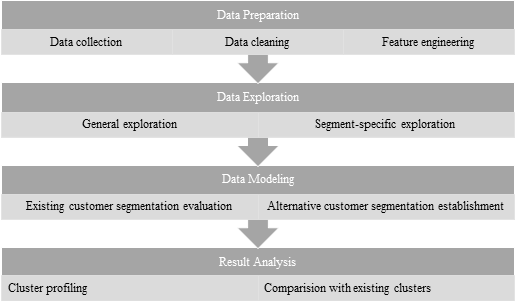

### **ML_Clustering_LuxuryTravelCustomerSegmentation**
###### This project develops an business solution─an automated machine learning clustering model─for the luxury travel industry, enabling customer segmentation and labeling to faciliate the subsequent establishment of a feature dashboard.

#### **1. [Process of Business Solution](Code/experient.ipynb)**

#### **2. [Data Collection](Code/data_collection.py)**
###### Sqlchemy and Pandas are leveraged in the step of data collection

#### **3. [Data Preparation](Code/data_preparation.py)**
###### 3.1 Numpy and Pandas are utilized in the step of data preparation for data cleaning.
###### 3.2 Feature engineering is conducted on the basis of RFM framework.

#### **4. [Data Exploration](Code/data_exploration.py)**
##### 4.1 

#### **5. Data Modeling**
###### The Process of data modeling for customer segmentation is exhibited below.

##### **5.1 [Data Preprocessing](Code/data_preprocessing.py)**
###### 5.1.1 Isolation Forest is deployed for outlier detection and initial segmentation.
###### 5.1.2 Principle Component Analysis (PCA) is employed for dimensionalty.

##### **5.2 [Model Training](Code/model_training.py)**

#### **Contact**
- ###### **Email:** jeff010426@gmail.com
- ###### **LinkedIn:** [LinkedIn Link](https://www.linkedin.com/in/chih-peng-javen-li-7b35561b9/)
