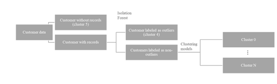

### **ML_Clustering_LuxuryTravelCustomerSegmentation**
##### This project developed an automated machine learning clustering model for the luxury travel industry, enabling customer segmentation and labeling to faciliate the subsequent establishment of a feature dashboard.

#### **1. Summary**
##### The 

##### **1.1 Workflow of Customer Segmentation**

#### **Contact**
- **Email:** jeff010426@gmail.com
- **LinkedIn:** [LinkedIn Link](https://www.linkedin.com/in/chih-peng-javen-li-7b35561b9/)
