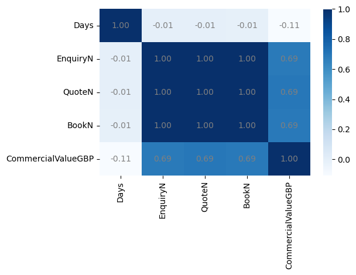
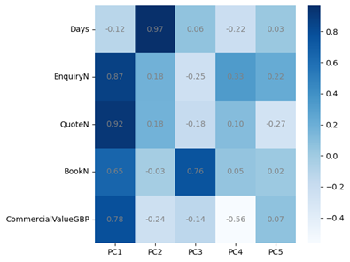
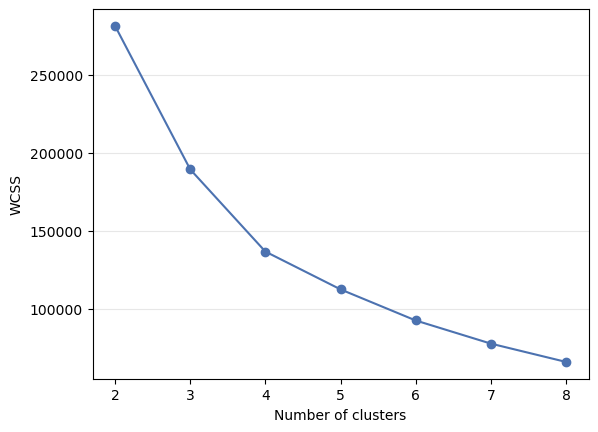

### **ML_Clustering_LuxuryTravelCustomerSegmentation**
#### This project develops an business solution─an automated machine learning clustering model─for the luxury travel industry, enabling customer segmentation and labeling to faciliate the subsequent establishment of a feature dashboard.

---
### 1. [Experiment](Code/experiment.ipynb)
#### The business solution for customer segmentation is designed.

#### 1.1 Data Preparation
##### Data is cleaned and RFM framework is applied for feature engineering.

#### 1.2 Data Exploration
##### 1.2.1 General Exploration
##### 1.2.2 Segment-Specific Exploration

#### 1.3 Data Modeling
##### 1.3.1 Outlier Detection
##### Isolation Forest is developed for outlier handling and initial customer segmentation

##### 1.3.2 Dimensionality Reduction
###### Principle Compoment Analysis (PCA) is conducted to reduce dimensionality
##### 1.3.3 Clustering Model Building
###### Five clustering models are constructed, namely KMeans, AHC, BIRCH, DBSCAN, Mean Shift.

###### ▲ The Scree plot of KMeans

#### 1.4 Model Evaluation

---
### 2. Production

---
#### 3. [Data Collection](Code/data_collection.py)
###### Sqlchemy and Pandas are leveraged in the step of data collection

---
#### 4. [Data Preparation](Code/data_preparation.py)
###### 3.1 Numpy and Pandas are utilized in the step of data preparation for data cleaning.
###### 3.2 Feature engineering is conducted on the basis of RFM framework.

---
#### 4. [Data Exploration](Code/data_exploration.py)
##### 4.1 General Exploration
![]

##### 4.2 Segment-Specific Exploration

---
#### 5. Data Modeling
###### The Process of data modeling for customer segmentation is exhibited below.

##### 5.1 [Data Preprocessing](Code/data_preprocessing.py)
###### 5.1.1 Isolation Forest is deployed for outlier detection and initial segmentation.
###### 5.1.2 Principle Component Analysis (PCA) is employed for dimensionalty.

##### 5.2 [Model Training](Code/model_training.py)

---
#### 6. Model Evaluation

---
#### 7. Model Deployment

##### 7.1 [Mlflow Tracking](Code/mlflow_tracking.py)
##### 7.2 [Model Selection](Code/model_selection.py)

---
#### **Contact**
- ###### **Email:** jeff010426@gmail.com
- ###### **LinkedIn:** [LinkedIn Link](https://www.linkedin.com/in/chih-peng-javen-li-7b35561b9/)
