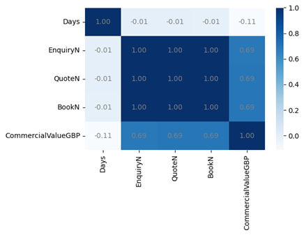

### **ML_Clustering_LuxuryTravelCustomerSegmentation**
#### This project develops an business solution─an automated machine learning clustering model─for the luxury travel industry, enabling customer segmentation and labeling to faciliate the subsequent establishment of a feature dashboard.

---
### 1. [Experiment](Code/experiment.ipynb)
#### The experiment exhibit the business solution for customer segmentation, including data preparation, data exploration, data modeling, model evaluation and Result Analysis.

#### 1.1 Data Preparation
##### Data is cleaned and RFM framework is applied for feature engineering.

#### 1.2 Data Exploration
##### 1.2.1 General Exploration
##### 1.2.2 Segment-Specific Exploration

#### 1.3 Data Modeling
##### 1.3.1 Outlier Detection
###### Isolation Forest is developed for outlier handling and initial customer segmentation
###### Correlation matrix is deployed to evaluate whether to conduct PCA

###### Loading Matrix is constructed to select the PC for further analysis, illustrating PC1 and PC2 are significant attributes.

##### 1.3.2 Dimensionality Reduction
###### Principle Compoment Analysis (PCA) is conducted to reduce dimensionality
##### 1.3.3 Clustering Model Building
###### Five clustering models are constructed, namely KMeans, AHC, BIRCH, DBSCAN, Mean Shift.
###### K-Means
###### The scree plot is visualized to determine the optimal number of K, manifesting that 3 and 4 are elbow points.

###### The clustering result of KMeans with K=3 and 4 are visualized.

###### AHC
###### The clustering result of AHC is visualized.

###### BIRCH
###### The clustering result of BIRCH with K=3 and K=4 are visualized

#### 1.4 Model Evaluation

---
#### 1.5 Result Analysis

---
### 2. Production
#### The key stages of the production-level clusting model development is demonstrated below.
#### 2.1 [Data Collection](Code/data_collection.py)
###### Sqlchemy and Pandas are leveraged in the step of data collection

---
#### 2.2 [Data Preparation](Code/data_preparation.py)
###### 2.2.1 Numpy and Pandas are utilized in the step of data preparation for data cleaning.
###### 2.2.2 Feature engineering is conducted on the basis of RFM framework.

---
#### 2.3. [Data Exploration](Code/data_exploration.py)
##### 2.3.1 General Exploration
![]

##### 2.3.2 Segment-Specific Exploration

---

#### 2.4 [Data Preprocessing](Code/data_preprocessing.py)
###### 2.4.1 Isolation Forest is deployed for outlier detection and initial segmentation.
###### 2.4.2 Principle Component Analysis (PCA) is employed for dimensionalty.

##### 2.5 [Model Training](Code/model_training.py)

---
#### 6. Model Evaluation

---
#### 7. Model Deployment

##### 7.1 [Mlflow Tracking](Code/mlflow_tracking.py)
##### 7.2 [Model Selection](Code/model_selection.py)

###
---
#### **Contact**
- ###### **Email:** jeff010426@gmail.com
- ###### **LinkedIn:** [LinkedIn Link](https://www.linkedin.com/in/chih-peng-javen-li-7b35561b9/)
