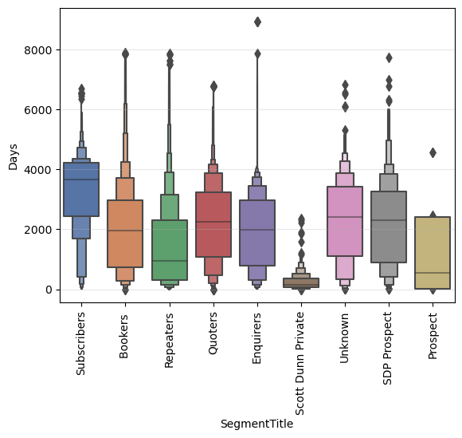
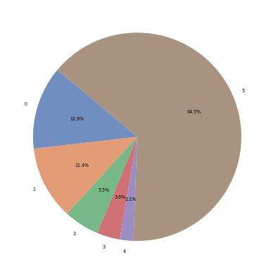
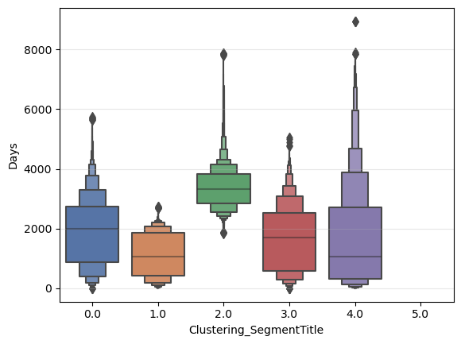
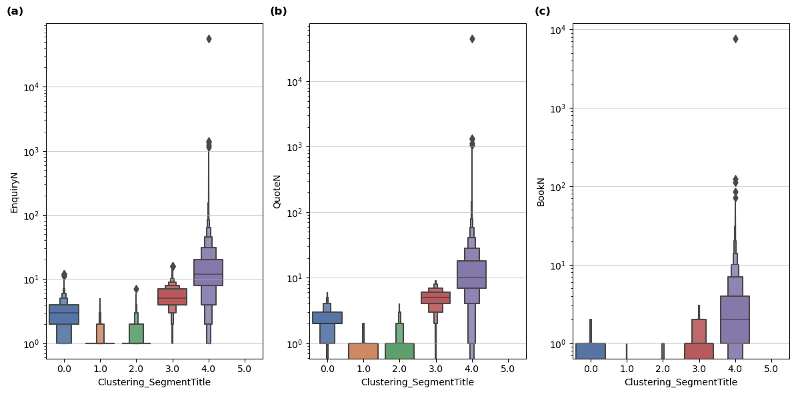
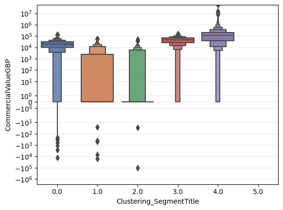
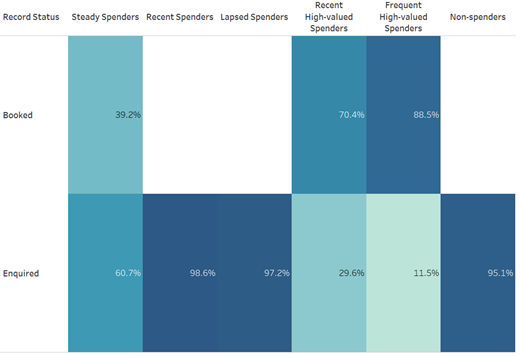
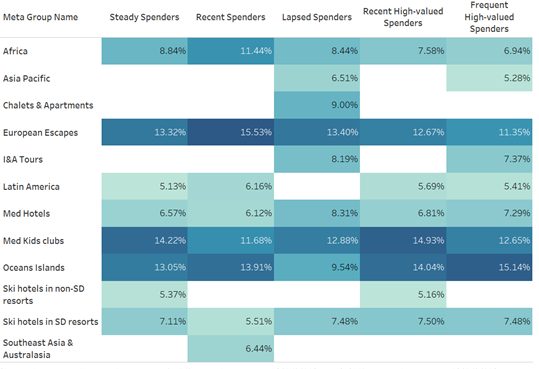
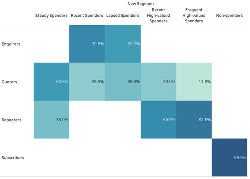

### **ML_Clustering_LuxuryTravelCustomerSegmentation**
#### This project develops an business solution─an automated machine learning clustering model─for the luxury travel industry, enabling customer segmentation and labeling to faciliate the subsequent establishment of a feature dashboard and formulation of strategy.
#### Expected Outcome
- #### Average value of target customer increase 59%
- #### Booking volume of target customer esclate 10%
- #### Efficiency of segmenting customers enhance 75%.

---
### 1. [Experiment](Code/experiment.ipynb)
#### The experiment exhibit the business solution for customer segmentation, including data preparation, data exploration, data modeling, model evaluation and Result Analysis.

#### 1.1 Data Preparation
##### Data is cleaned and RFM framework is applied for feature engineering.

#### 1.2 Data Exploration
##### 1.2.1 General Exploration
  
  
  
  

##### 1.2.2 Segment-Specific Exploration

  

#### 1.3 Data Modeling
##### 1.3.1 Outlier Detection
###### Isolation Forest is developed for outlier handling and initial customer segmentation.
###### The outliers exhibit greater recency, frequency and monetary, consequently, outliers are grouped into a segment.

  

##### 1.3.2 Dimensionality Reduction
###### Principle Compoment Analysis (PCA) is conducted to reduce dimensionality.
###### Correlation matrix is deployed to evaluate whether to conduct PCA.

###### Loading Matrix is constructed to select the PC for further analysis, illustrating PC1 and PC2 are significant attributes.
  

##### 1.3.3 Clustering Model Building
###### Five clustering models are constructed, namely KMeans, AHC, BIRCH, DBSCAN, Mean Shift.  

###### K-Means
###### The scree plot is visualized to determine the optimal number of K, manifesting that 3 and 4 are elbow points.

###### The clustering result of KMeans with K=3 and 4 are visualized.

  

###### AHC
###### The clustering result of AHC is visualized.
  

###### BIRCH
###### The clustering result of BIRCH with K=3 and K=4 are visualized

  

###### DBSCAN
###### The clustering result of DBSCAN is visualized.
  

###### Mean Shift
###### The clustering result of Mean Shift is visualized.
  

#### 1.4 Model Evaluation
##### 1.4.1 Effectiveness
###### According to the clustering results above, KMeans and BIRCH algorithm are capable for this clustering task.  

##### 1.4.2 Similarity
###### Internal cluster validity index (CVIs), Silhouette, Calinski-Harabasz, and Davies-Bouldin indices, are computed, standardized and labelled as “ScaleddScore” to compare cohesion and separation degree within clusters of each model.
  

##### 1.4.3 Stability
###### The clustering outcomes performed by each model on the entire dataset are regarded as the true labels. Each model is re-trained to predict on 50% and 25% subsamples of the data without setting a random seed, with the resulting clusters treated as predicted labels. Subsequently, the Rand Index of each model is computed based on true and predicted labels.
  

##### 1.4.4 Summary
###### K-Means with K=4 is chosen to segment customers given its relatively high extent of effectiveness of clustering, similarity and stability.  

#### 1.5 Result Analysis
##### Customers are grouped into five clusters and their features are further analyzed.

###### According to the above boxen plots regarding RFM attributes, Customers within cluster 4 and 3 are named as “Frequent High-valued Spenders” and “Recent High-valued Spenders”, separately, given their relatively high recency, frequency, and monetary. Guests within cluster 0 is labeled as “Steady Spenders”, as they exhibit moderate frequency and spending and possess fairly recent records. Cluster 1 is named as “Recent Spenders”, since they placed highly recent bookings, whereas, their records are infrequent and low-valued. Clients within cluster 2 is labeled as “Lapsed Guests”, given that their records are with the least recency, high infrequency, and the lowest spending. Clients within cluster 5 are marked as “Non-spenders” as they do not place any order.

---
### 2. Production
#### The key stages of the production-level clusting model development is demonstrated below.  

#### 2.1 [Data Collection](Code/data_collection.py)
###### Sqlchemy and Pandas are leveraged in the step of data collection.  

#### 2.2 [Data Preparation](Code/data_preparation.py)
###### 2.2.1 Numpy and Pandas are utilized in the step of data preparation for data cleaning.
###### 2.2.2 Feature engineering is conducted on the basis of RFM framework.  

#### 2.3. [Data Exploration](Code/data_exploration.py)
##### 2.3.1 General Exploration
##### 2.3.2 Segment-Specific Exploration  

#### 2.4 [Data Preprocessing](Code/data_preprocessing.py)
##### 2.4.1 Isolation Forest is deployed for outlier detection and initial segmentation.
##### 2.4.2 Principle Component Analysis (PCA) is employed for dimensionality reduction.  

#### 2.5 [Model Training](Code/model_training.py)
##### K-Means with K=4 is selected for production.  

#### 2.6 Model Deployment
##### 2.6.1 [Mlflow Tracking](Code/mlflow_tracking.py)
###### MLflow is utilized to track each re-trained model.
##### 2.6.2 [Model Selection](Code/model_selection.py)
###### The model with the best performance is selected for production.  

#### 2.7 [Label Production](Code/data_upload)
##### Clustering result are uploaded and customers are labeled.
##### Feature dashboard of customers can be developed for further analysis.  

#### 2.8 [Main Pipeline](Code/main.py)

---
#### **Contact**
##### **Email:** jeff010426@gmail.com
##### **LinkedIn:** [LinkedIn Link](https://www.linkedin.com/in/chih-peng-javen-li-7b35561b9/)
